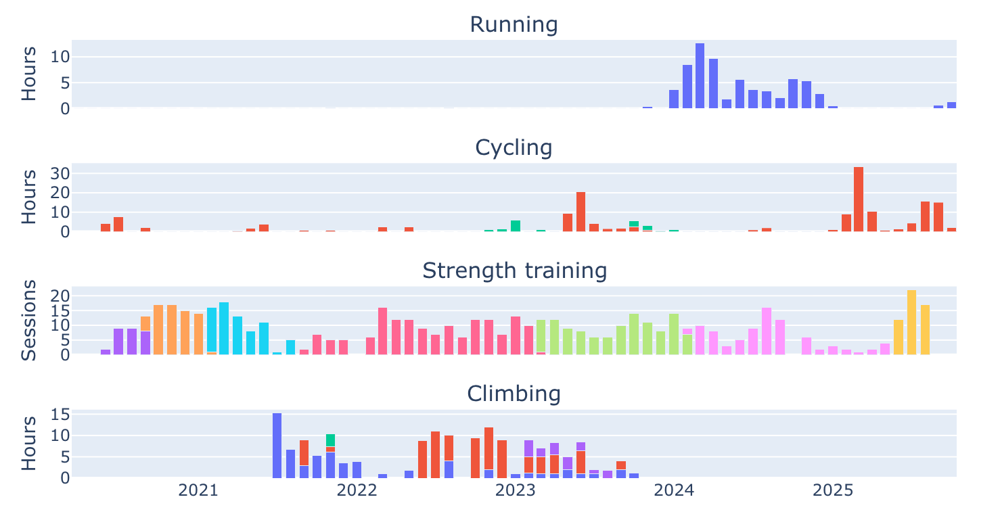
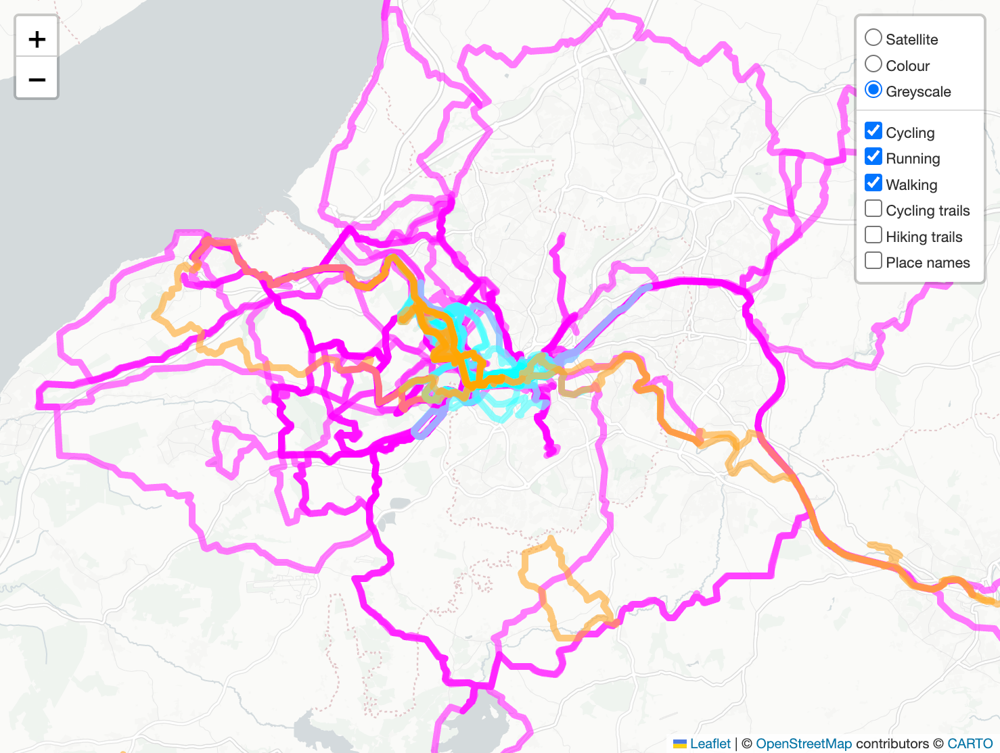
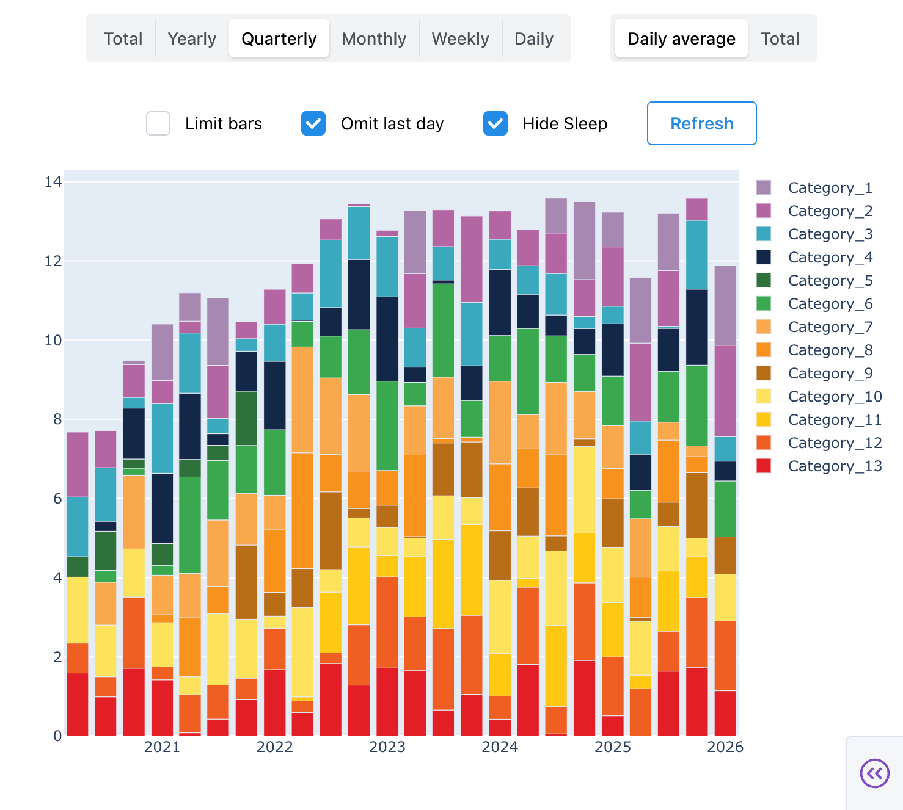
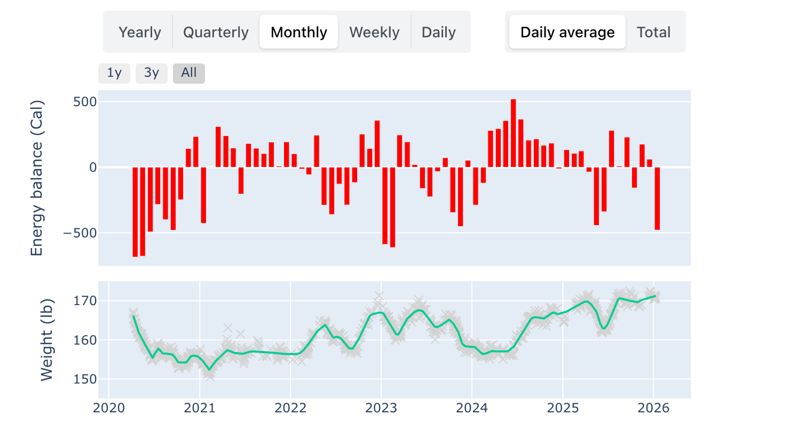
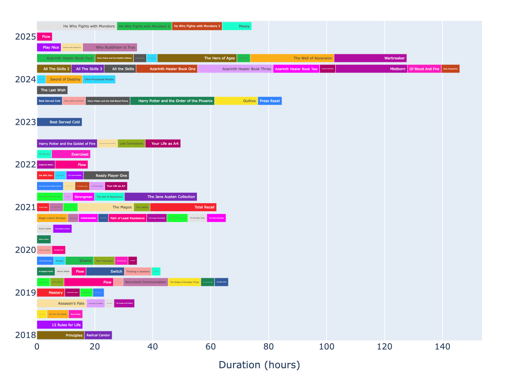

# Self tracking data analysis

This is a collection of Python scripts I use for analysing health, habit and workout data.

My goal for these scripts is to do the following:

- Extract data from multiple sources (Apple Health, GPX routes, calendar events, etc.)
- Process it and store in TSV format
- Graph it with a Plotly/Dash dashboard

## Data sources

To access data from Apple Watch/Apple Health I use a hybrid approach:

- Export all data from Apple Health as one massive XML file and process it (this is *extremely slow*)
- Use a daily scheduled Apple Shortcut with the [HealthExport app](https://healthexport.app/) to access recent data and process it

From my Apple Watch I use active calories, workouts and sleep data. I use various other apps for logging calories eaten, weight and other types of workouts and most of them sync with Apple Health.

## Workout data

In the recent past I've jumped around between running, cycling, strength training and climbing as my main forms of exercise.

Running and cycling data is merged from old Garmin records and recent Apple Watch workouts. Strength training data comes from the [Strong app](https://www.strong.app/). Climbing data comes from calendar events.

## ATracker (time logging)

I use an app called [ATracker](https://atracker.pro/) from my watch to log how I spend my time in broad categories. I sync to my calendar using the app and then use [this script](self_tracking/importers/atracker.py) to access it on my Mac.

It uses a slightly old command line tool called icalBuddy to extract only recent events and append them to a TSV file. I've also tried using Apple Shortcuts to export calendar events in the past (see [this file](self_tracking/importers/climbing.py)) but found that approach to be unreasonably slow for large calendars.

For privacy reasons I don't want to show real data so here's an example screenshot with fake data:

## Calories and weight

I've used multiple calorie tracking apps in the past but currently prefer [MyNetDiary](https://www.mynetdiary.com/). Weight data comes from WiFi synced Withings scales.

The ups and down in this graph are somewhat intentional attempts at bulking and cutting. It's a bit messy due to constantly shifting focus between strength training and cardio though.

## Kindle and Audible reading history

You can request to "export all of your data" from Amazon. It comes back in a very messy database dump format though. This was my attempt to format it nicely and combine reading hours on Kindle with listening hours on Audible while grouping them into a readable timeline. It does not include paper books I read during or before the timeline.

